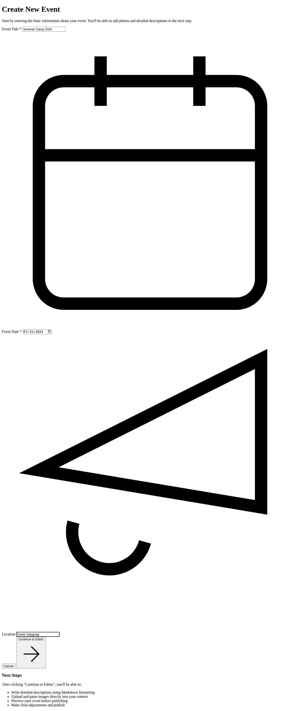
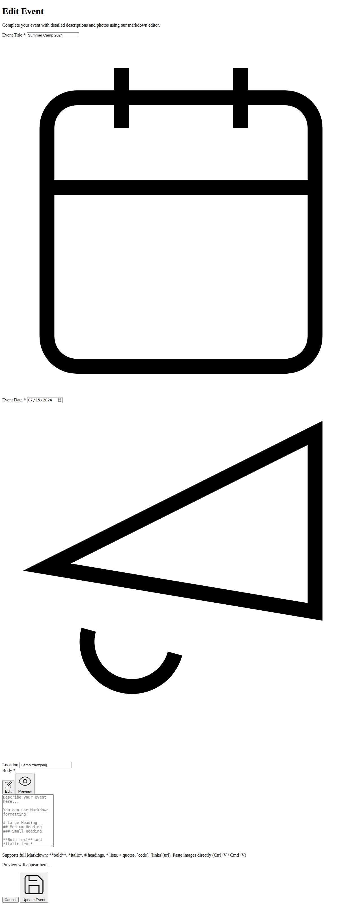

# Event Creation Workflow - Two-Step Process

This document describes the new two-step event creation process implemented in the Troop-185 portal.

## Overview

The event creation has been restructured from a single comprehensive form into a two-step process:

1. **Preliminary Form** - Basic event information
2. **Full Editor** - Complete markdown editor with image upload

## Step 1: Preliminary Form (`/portal/create-event`)


### Features:
- **Event Title** - Required field for the event name
- **Event Date** - Required date picker
- **Location** - Optional location field
- **Next Steps Guide** - Information about what comes next



### Process:
1. User fills in basic event details
2. Clicks "Continue to Editor"
3. System creates a draft event in the database
4. User is redirected to the full editor with the event ID

## Step 2: Full Editor (`/portal/upload-event?id=<eventId>`)



### Features:
- **Pre-filled Basic Info** - Title, date, and location from Step 1
- **Dual Markdown Editor** - Edit/Preview toggle functionality
- **Image Upload** - Paste images directly (Ctrl+V / Cmd+V)
- **Rich Markdown Support** - Full markdown formatting capabilities


### Markdown Editor Capabilities:
- **Headers** - H1, H2, H3 with `#`, `##`, `###`
- **Text Formatting** - **Bold**, *Italic*
- **Lists** - Bulleted and numbered lists
- **Quotes** - Blockquotes with `>`
- **Code** - Inline `code` and code blocks
- **Links** - Standard markdown links
- **Images** - Direct image paste functionality
- **Horizontal Rules** - Section separators with `---`


## Technical Implementation

### Database Schema Updates
- Added `isDraft` boolean field to support draft events
- Made `body` field optional for draft events
- Added proper `imageAliases` mapping support

### API Endpoints

#### POST `/portal/create-event`
Creates a preliminary draft event with basic information.

**Request:**
```json
{
  "eventTitle": "Summer Camp 2024",
  "eventDate": "2024-07-15",
  "location": "Camp Yawgoog"
}
```

**Response:**
```json
{
  "success": true,
  "message": "Event draft created successfully",
  "eventId": "60d5ecb74b3b2c001f5e4e8a"
}
```

#### POST `/portal/upload-event?id=<eventId>`
Updates an existing event with full content and publishes it.

**Request:**
```json
{
  "eventTitle": "Summer Camp 2024",
  "eventDate": "2024-07-15",
  "location": "Camp Yawgoog",
  "description": "# Event content in markdown...",
  "imageAliases": {
    "%image-1%": "data:image/png;base64,..."
  }
}
```

### File Structure
```
src/routes/portal/
├── create-event/
│   ├── +page.svelte          # Preliminary form UI
│   └── +server.ts            # Draft creation API
└── upload-event/
    ├── +page.svelte          # Full editor UI (updated)
    ├── +page.server.ts       # Event loading logic
    └── +server.ts            # Event creation/update API
```

## User Benefits

1. **Simplified Start** - Users can quickly create an event with just basic info
2. **Progressive Enhancement** - Full editing capabilities available in step 2
3. **Draft Support** - Events can be saved as drafts and completed later
4. **Image Integration** - Seamless image paste and upload workflow
5. **Live Preview** - See formatted content before publishing

## Navigation Flow

```
/portal/create-event
      ↓ (Submit preliminary form)
      ↓ (Creates draft event)
      ↓ (Redirects with event ID)
/portal/upload-event?id=<eventId>
      ↓ (Complete and publish)
      ↓ (Success)
/portal (or event list)
```

This two-step approach makes event creation more user-friendly while preserving all the powerful editing capabilities of the original system.